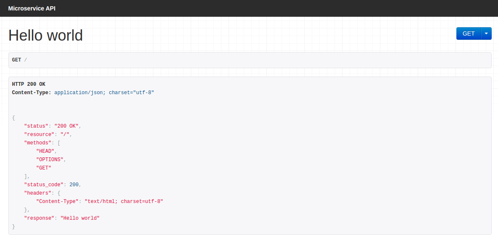
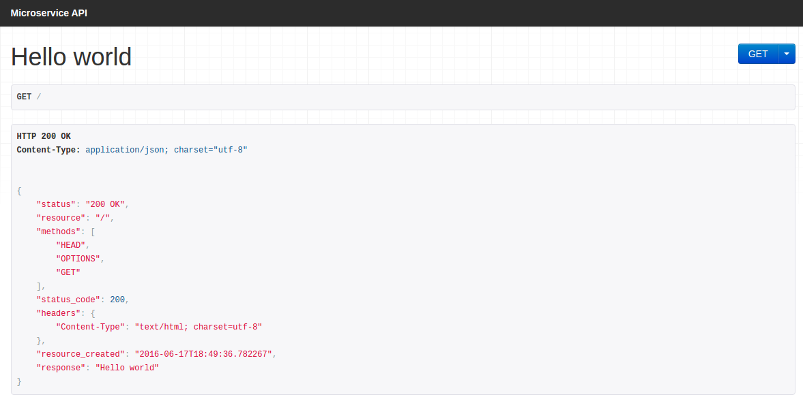
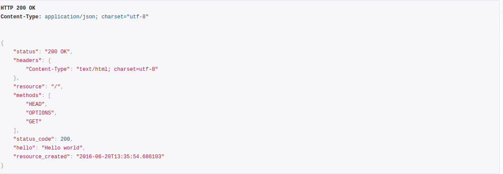
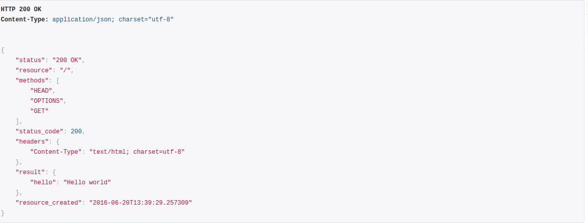

# HTTP Microservice

## Flask-API

HTTP implementation of microservices based on Flask-API

```
from microservices.http.service import Microservice

app = Microservice(__name__)
```

Where `app` - is a standard flask-api application

You can add route, how in the flask-api

```
@app.route('/')
def hello_world():
    return 'Hello world'
```

And run in debug mode

```
if __name__ == '__main__':
    app.run(debug=True)
```

Start app:

```
python hello_world.py
```

You will see in console:

```
 * Running on http://127.0.0.1:5000/ (Press CTRL+C to quit)
 * Restarting with stat
 * Debugger is active!
 * Debugger pin code: 301-234-464
```

Let's open http://127.0.0.1:5000/ in browser

You will see:


This is a standard browsable page for api, generated by flask-api

## ResourceMarker

Let's add ResourceMarker to function hello_world
```
from microservices.http.resources import ResourceMarker
```

```
@app.route(
    '/',
    resource=ResourceMarker(),
)
def hello_world():
    return 'Hello world'
```

After reload page you will see


You can see additional information

* status
* resource
* methods
* status_code
* headers
* response

As you can see, dictionary returned, and "Hello world" in key "response".
This default behavior.

Let's change it.

Add dictionary for update response

```
resource=ResourceMarker(
    update={
        'resource_created': datetime.datetime.now().isoformat()
    },
)
```

Reload a page



New key "resource_created" in response. If you try reload page again, datetime will
not changed. This is static information for resource.

Note:
> status, resource, methods, status_code, headers you will see only in browser, if you
> run curl or another http client, not browser, you will see only "response" and "update"
> dictionary, like this:
> ```
> {"response": "Hello world", "resource_created": "2016-06-17T18:49:36.782267"}
> ```

## ResourceSchema

Ok, let's do more customizations! And use ResourceSchema

Importing `ResourceSchema` from `microservices.http.resources`
```
from microservices.http.resources import ResourceMarker, ResourceSchema
```

And change something, ex. response name
```
    schema=ResourceSchema(
        response='result',
    )
```

Let's see
```
resource=ResourceMarker(
    update={
        'resource_created': datetime.datetime.now().isoformat()
    },
    schema=ResourceSchema(
        response='result',
    )
)
```


Was `"respone": "Hello world"` and now `"result": "Hello world"`

Want a more? OK!

If your response is a dict, by default response will be updated from your response

```
def hello_world():
    return {'hello': 'Hello world'}
```



If you want reponse all data in your response key name, you can change a policy:

```
resource=ResourceMarker(
    update={
        'resource_created': datetime.datetime.now().isoformat()
    },
    schema=ResourceSchema(
        response='result',
        response_update=False,
    )
),
```

And you will see:
```
"result": {
    "hello": "Hello world"
},
```



By default for non-browser clients technical information (as status, headers, url) will be ignored.
You can change this and rename response keys

Example:


